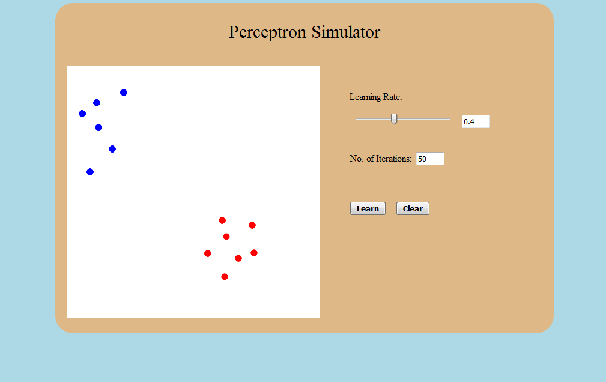

# Procedure

- Left click on the board to plot blue color samples.

step1

- Right click on the board to plot Red color samples.

- Adjust Learning rate to level of your choice.

- Input no. of Iterations to be performed.

- Click on Learn Button to plot Perceptron line dividing the Blue and Red Samples.

- Click on Clear Button to Perform the experiment again.

 