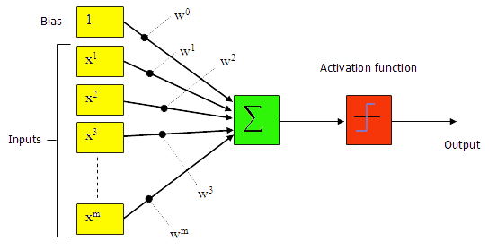

# Introduction

The perceptron is a type of artificial neural network invented in 1957 at the Cornell Aeronautical Laboratory by Frank Rosenblatt. It can be seen as the simplest kind of feedforward neural network: a linear classifier.

# Theory

## Perceptron

- The method of storing and recalling information and experiences in the brain is not fully understood. However, experimental research has enabled some understanding of how neurons appear to gradually modify their characteristics because of exposure to particular stimuli.
- The most obvious changes have been observed to occur in the electrical and chemical properties of the synaptic junctions. For example the quantity of chemical transmitter released into the synaptic cleft is increased or reduced, or the response of the post-synaptic neuron to receive transmitter molecules is altered.
- The overall effect is to modify the significance of nerve impulses reaching that synaptic junction on determining whether the accumulated inputs to post-synaptic neuron will exceed the threshold value and cause it to fire.
- Thus learning appears to effectively modify the weighting that a particular input has with respect to other inputs to a neuron.

Thus learning appears to effectively modify the weighting that a particular input has with respect to other inputs to a neuron.

- Perceptron may have continuous valued inputs.
- It works in the same way as the formal artificial neuron defined previously.
- Its activation is determined by equation:

$$ a=w^{T_u}+\theta $$ 

- Moreover, its output function is:

$$ f(a)=((+1,   for a >= 0),(-1,   for 0 < a)) $$

having value either +1 or -1.

The Structure of a Perceptron is given below:

***Fig. 1: Perceptron***

- Now, consider such a perceptron in N dimensional space , the equation:

$$ a=w^{T_u}+\theta = 0 $$ 

that is,

$$  w_1u_1+w_2u_2+w_3u_3+.........+w_Nu_N+theta=0 $$

defines a hyperplane.

- This hyperplane divides the input space into two parts such that at one - side, the perceptron has output value +1, and in the other side, it is -1.
- A perceptron can be used to decide whether an input vector belongs to one of the two classes, say classes A and B.
- The decision rule may be set as to respond as class A if the output is +1 and as class B if the output is -1.
- The perceptron forms two decision regions separated by the hyperplane.
- The equation of the boundary hyperplane depends on the connection weights and threshold.

